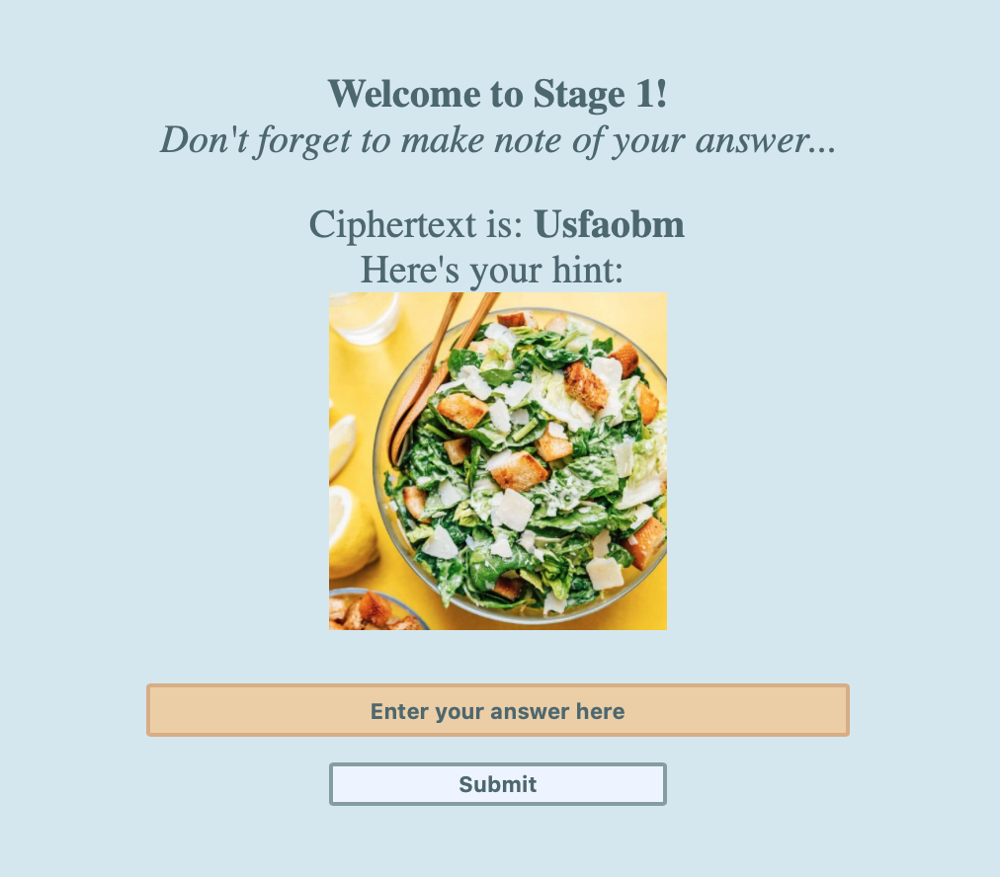
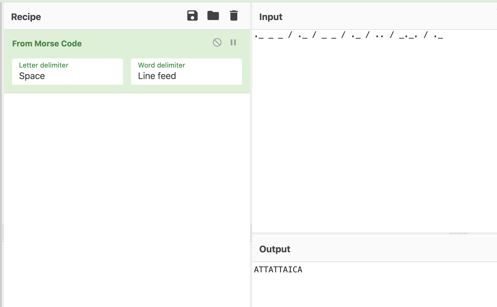
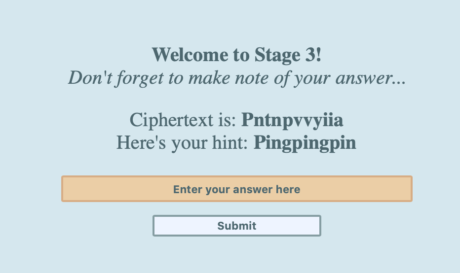
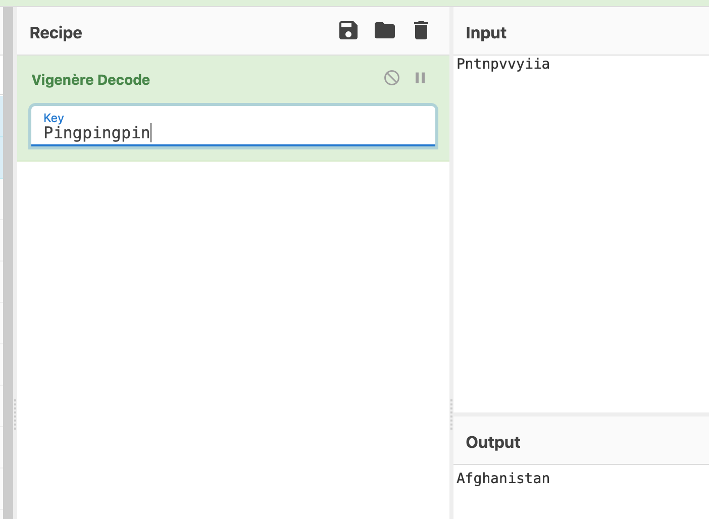
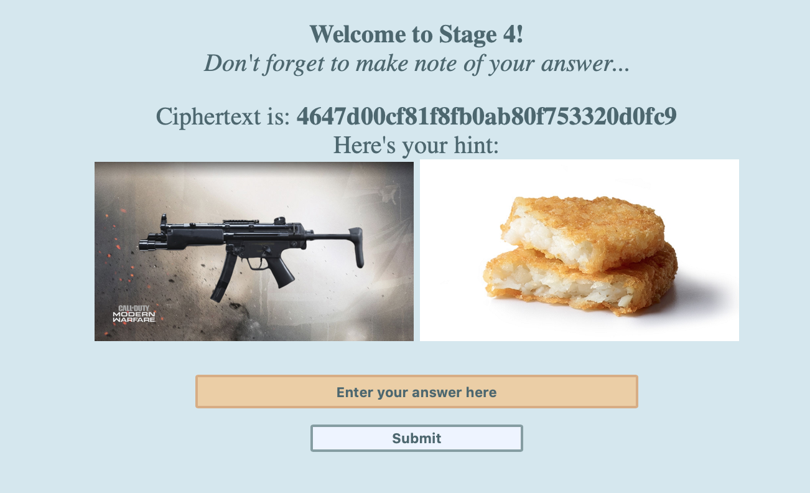

# 4 Stage = 4x Better

We are given the link:
```
https://chal.hackmac.xyz:30105
```


The title tells us we have 4 stages to get through.

**Stage 1:**



A caesar salad can only mean one thing - Caesar cipher. Running it through CyberChef (rotating through all the numbers until we reached a word) gives us:

`Germany`


**Stage 2:**


This definitely looks like morse code but running it through CyberChef gives us something that doesn't look right (confirmed by trying to submit it in the final flag).



Even trying to change the delimiter to a forward slash did not provide a result:


So, by manually checking each one against the morse code lookup table:


We got:

`Jamaica`

**Stage 3:**



This definitely looks like a substitution cipher, but it wasn't immediately clear that the 'hint' was actually a 'key'. After trying a couple of manual substitutions, we tried the Vigenere decode on it and it returned:

`Afghanistan`



**Stage 4:**



The weapon appears to be an MP5, and a hash brown likely means it relates to a hash. So by running the text we were given, on an MD5 hash decode lookup 
```
https://md5.gromweb.com/?md5=4647d00cf81f8fb0ab80f753320d0fc9
```

We get:

`Indonesia`


The next page shows us that the words we found are the flag:


```
hackmac{GermanyJamaicaAfghanistanIndonesia}
```