# Report - Universal Cereal Bus

## Table of Contents

- [Report - Universal Cereal Bus](#report---universal-cereal-bus)
  - [Table of Contents](#table-of-contents)
- [4 Stage = 4x Better](#4-stage--4x-better)
- [All The Wrappers](#all-the-wrappers)
- [Ancient Rome](#ancient-rome)
- [Connect Home](#connect-home)
- [Intelli-telnet](#intelli-telnet)
- [Remote Access 1](#remote-access-1)
  - [Solve with hint](#solve-with-hint)
  - [Intended solution](#intended-solution)
- [Remote Access 2](#remote-access-2)
- [RTSP That Thing](#rtsp-that-thing)
- [Smart Camera Secret File](#smart-camera-secret-file)
- [Time for a Little Magic Trick](#time-for-a-little-magic-trick)
- [Where's Wally](#wheres-wally)


# 4 Stage = 4x Better

We are given the link:
```
https://chal.hackmac.xyz:30105
```
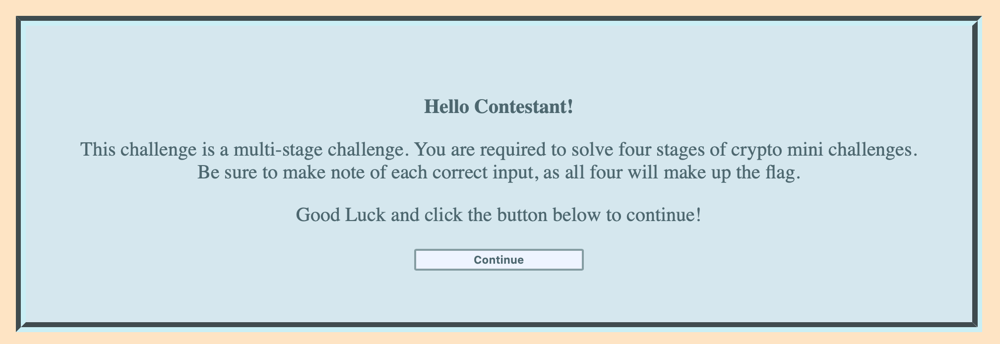

The title tells us we have 4 stages to get through.

**Stage 1:**

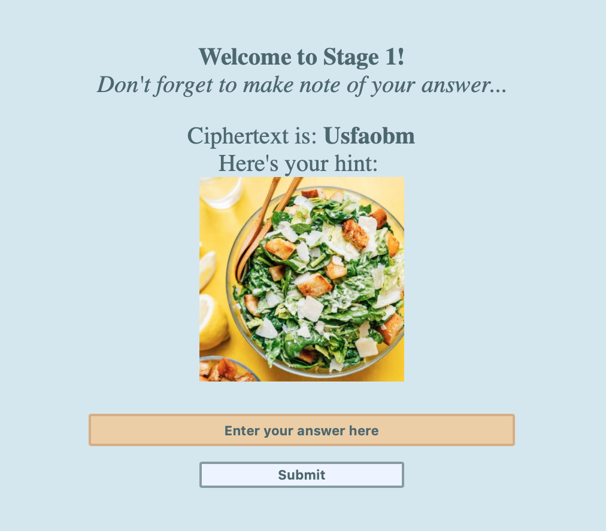

A caesar salad can only mean one thing - Caesar cipher. Running it through CyberChef (rotating through all the numbers until we reached a word) gives us:

`Germany`

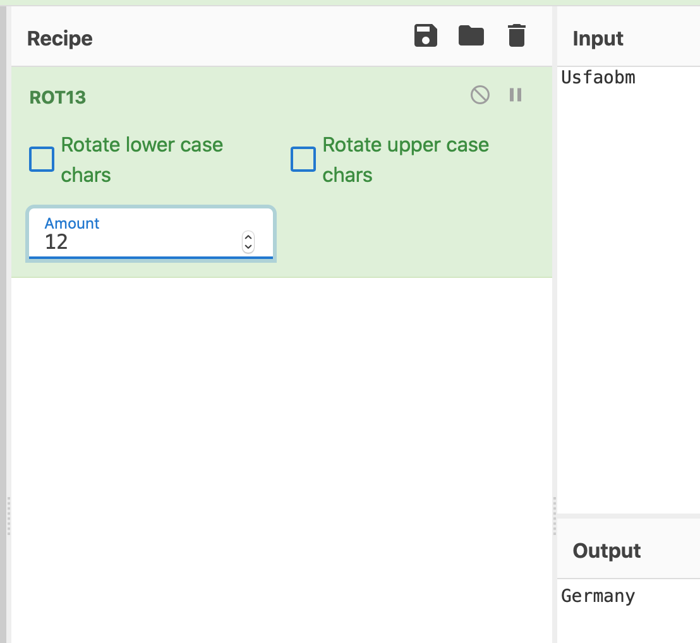

**Stage 2:**

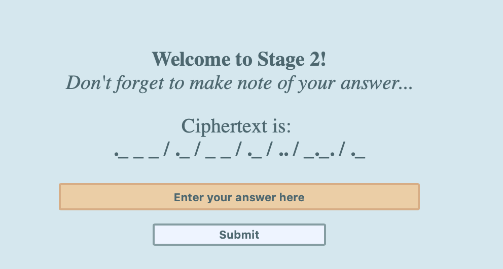

This definitely looks like morse code but running it through CyberChef gives us something that doesn't look right (confirmed by trying to submit it in the final flag).

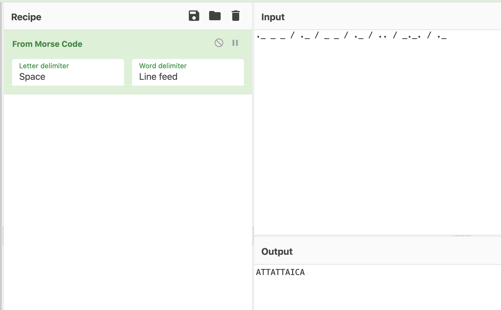

Even trying to change the delimiter to a forward slash did not provide a result:

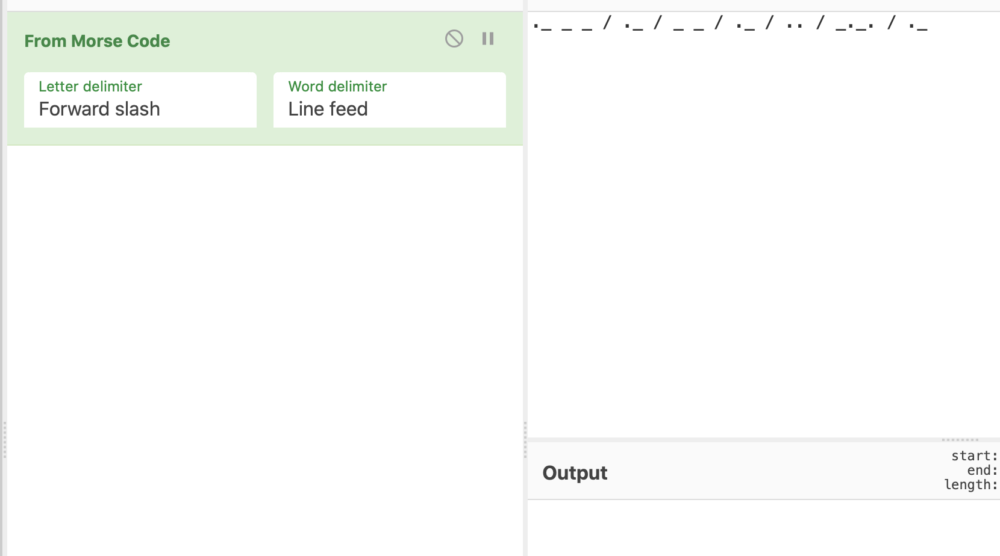

So, by manually checking each one against the morse code lookup table:

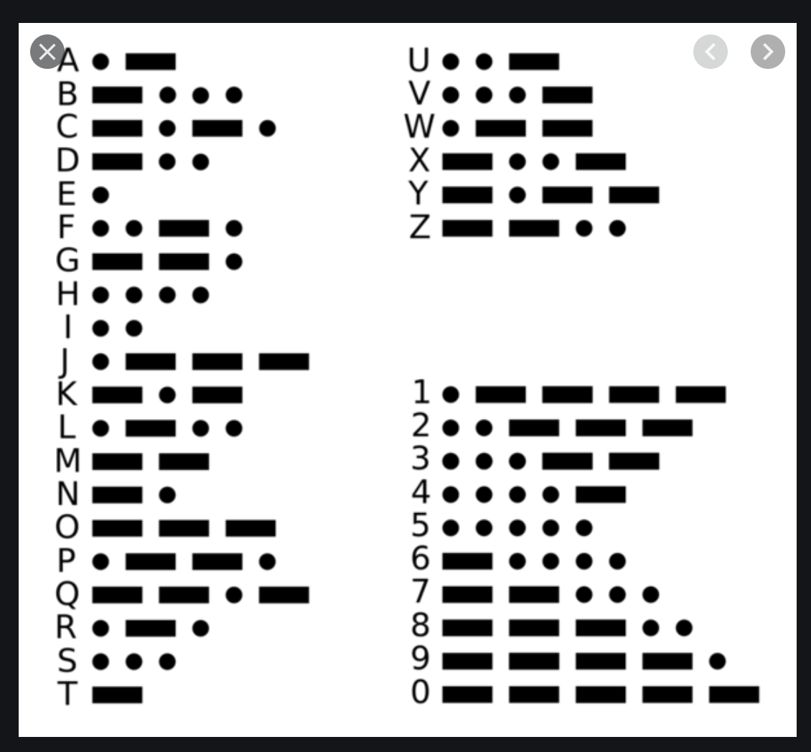

We got:

`Jamaica`

**Stage 3:**

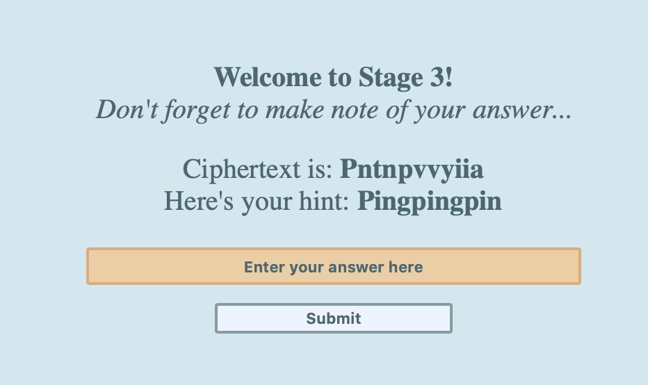

This definitely looks like a substitution cipher, but it wasn't immediately clear that the 'hint' was actually a 'key'. After trying a couple of manual substitutions, we tried the Vigenere decode on it and it returned:

`Afghanistan`

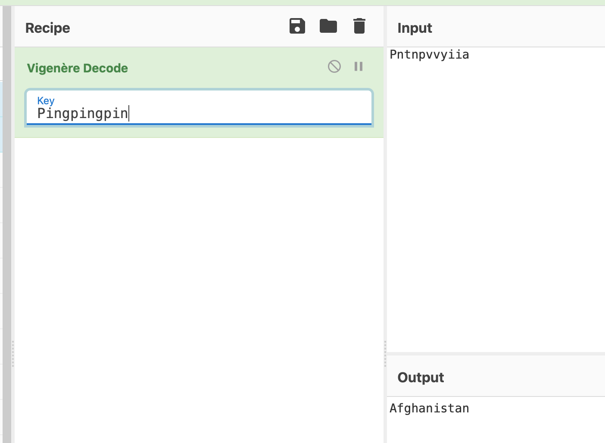

**Stage 4:**

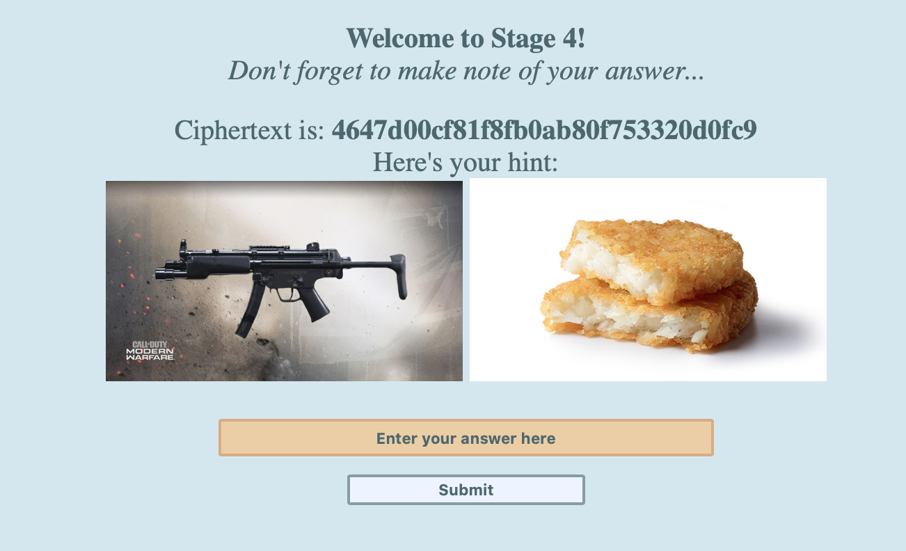

The weapon appears to be an MP5, and a hash brown likely means it relates to a hash. So by running the text we were given, on an MD5 hash decode lookup 
```
https://md5.gromweb.com/?md5=4647d00cf81f8fb0ab80f753320d0fc9
```

We get:

`Indonesia`

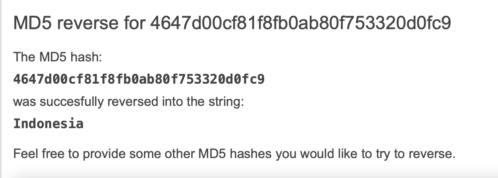


The next page shows us that the words we found are the flag:

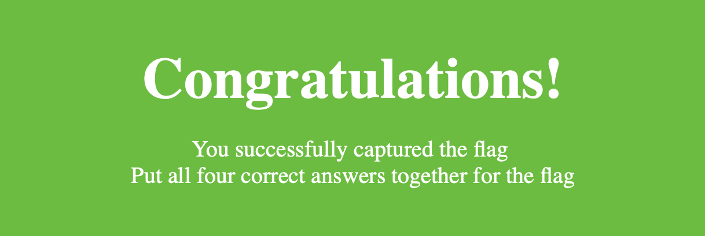

```
hackmac{GermanyJamaicaAfghanistanIndonesia}
```


# All The Wrappers

We are given the file `Present.gz` which appears to be a `gzipped` compressed file. To confirm, we will run the `file` command:

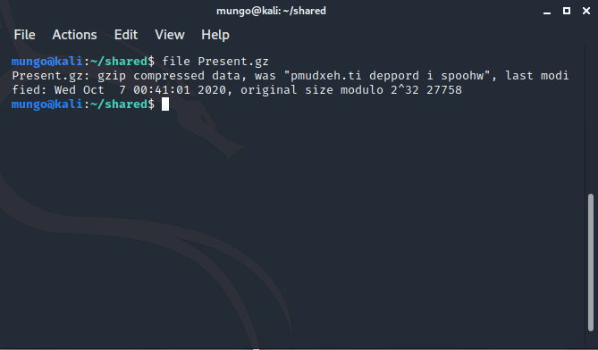

This confirms that it is indeed a gzip file. We also get a hint for a later phase of the challenge in the previous filename, `pmudxeh.ti deppord i spoohw`, which is `whoops i dropped it.hexdump` in reverse. For the meantime, we will unzip the file using the `gunzip` command:
```bash
$ gunzip Present.gz
```

This gives us an uncompressed file. We'll run `file` again to see what to do with it:

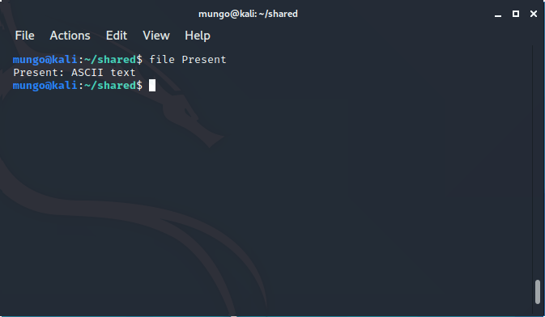

Running `cat` to display the contents of the file reveals it is indeed a hexdump. 

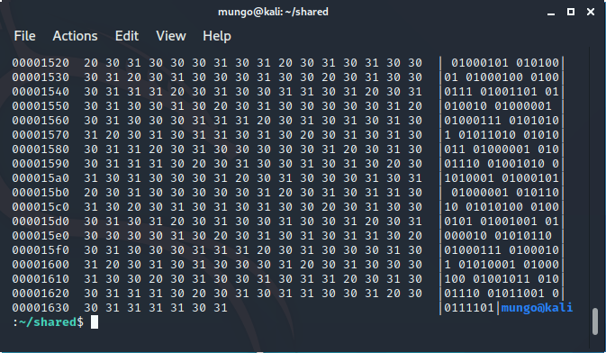

To reverse the hexdump into what appears to be binary, `xxd` with the `-r` option will give us a file with the original data:

```bash
$ xxd -r > file.txt
```

Now that we have this binary data, we can use the web tool CyberChef to decode it. With the binary input from the file, we can conver it:

1. From Binary:

```
GU2CANBZEAZTEIBVGIQDKNJAGMZCANJSEA2TIIBTGIQDKNBAHE3SAMZSEA2TIIBUHEQDGMRAGUYSANJQEAZTEIBVGEQDIOJAGMZCANJUEA2TMIBTGIQDKMZAGU3SAMZSEA2TCIBVGEQDGMRAGU2SANJSEAZTEIBVGQQDSOBAGMZCANJUEA2TAIBTGIQDKMJAGQ4SAMZSEA2TCIBVG4QDGMRAGUYSANJTEAZTEIBVGQQDKMBAGMZCANJREA2TCIBTGIQDKMZAGU2CAMZSEA2TIIBVGQQDGMRAGU2CANJQEAZTEIBVGIQDKNJAGMZCANJUEA4TSIBTGIQDKNJAGUYCAMZSEA2TGIBZG4QDGMRAGUZSANJUEAZTEIBVGEQDKNZAGMZCANJREA2TGIBTGIQDKNBAGUYCAMZSEA2TCIBVGEQDGMRAGUZSANJUEAZTEIBVGUQDKNZAGMZCANJTEA2TMIBTGIQDKMJAGUYSAMZSEA2TEIBVGAQDGMRAGU2SANJXEAZTEIBVGMQDSNZAGMZCANJTEA2TMIBTGIQDKMRAGEYDCIBTGIQDKNBAHE4SAMZSEA2TIIBVGAQDGMRAGU2CAMJQGEQDGMRAGUZSANJQEAZTEIBVGEQDKNY=
```
The `=` sign at the end of the string indicates it's a number system of a higher base, such as base32 or base64. As there are only upper-case characters visible, we can assume base32.

2. From Base32:
   
```
54 49 32 52 55 32 52 54 32 54 97 32 54 49 32 51 50 32 51 49 32 54 56 32 53 57 32 51 51 32 55 52 32 54 98 32 54 50 32 51 49 32 51 57 32 51 53 32 54 50 32 51 51 32 53 54 32 54 54 32 54 50 32 52 55 32 54 99 32 55 50 32 53 97 32 53 54 32 51 57 32 51 53 32 54 50 32 51 51 32 53 54 32 55 57 32 53 56 32 51 51 32 52 50 32 55 57 32 53 97 32 53 56 32 52 101 32 54 99 32 54 50 32 54 101 32 53 50 32 51 57
```

As there are instances of the digit `9`, this can't be octal. There are no letters, so it probably isn't hexadecimal. We will assume this is in decimal.

3. From Decimal:

```
61 47 46 6a 61 32 31 68 59 33 74 6b 62 31 39 35 62 33 56 66 62 47 6c 72 5a 56 39 35 62 33 56 79 58 33 42 79 5a 58 4e 6c 62 6e 52 39
```

This looks like hexadecimal, as there are no letters above `f`.

4. From Hexadecimal:

```
aGFja21hY3tkb195b3VfbGlrZV95b3VyX3ByZXNlbnR9
```
We can see a combination of digits, uppercase and lowercase alphabetical characters, so this could be base64.

5. From Base64:

```
hackmac{do_you_like_your_present}
```

There's our flag!

This is what the final CyberChef window looks like:
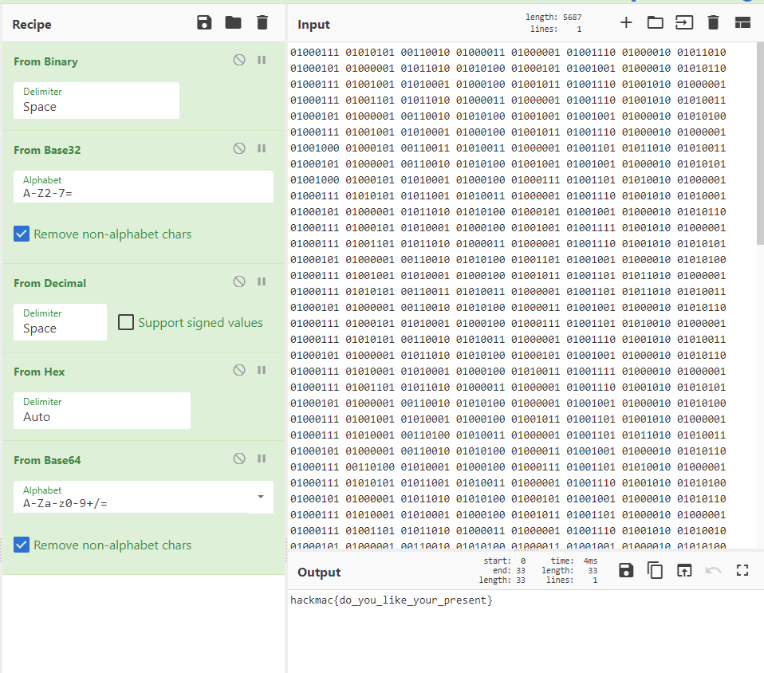


# Ancient Rome

Since the challenge is in the crypto section, the name hints that we are potentially dealing with a Caesar cipher. We are given the link:
```
https://chal.hackmac.xyz:30106
```

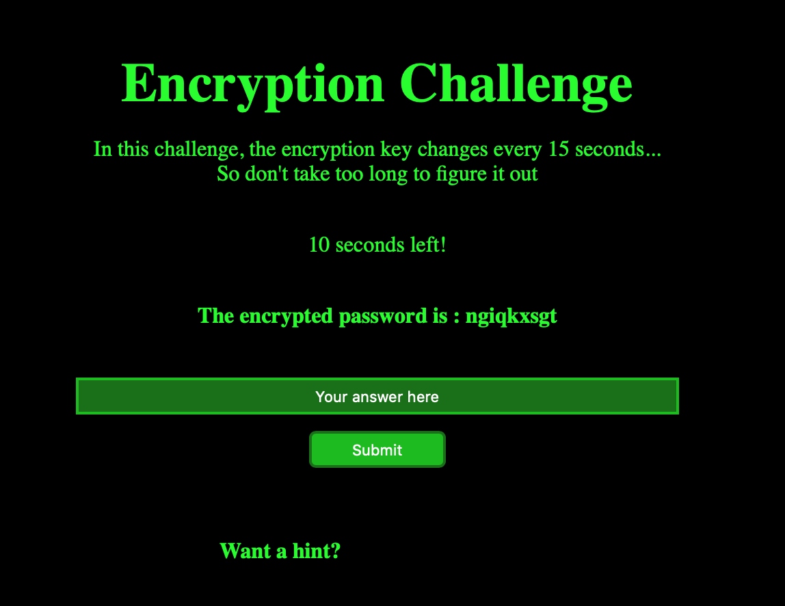

We are given a hint that confirms this has to do with Caesar:

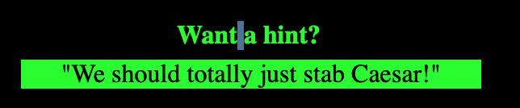

By having CyberChef loaded, and quickly putting the encrypted password in, the only thing left is to shift by a random number (or seemingly random, as it changed with each encrypted password we tried), in less than 15 seconds, until we are left with a word that makes sense:

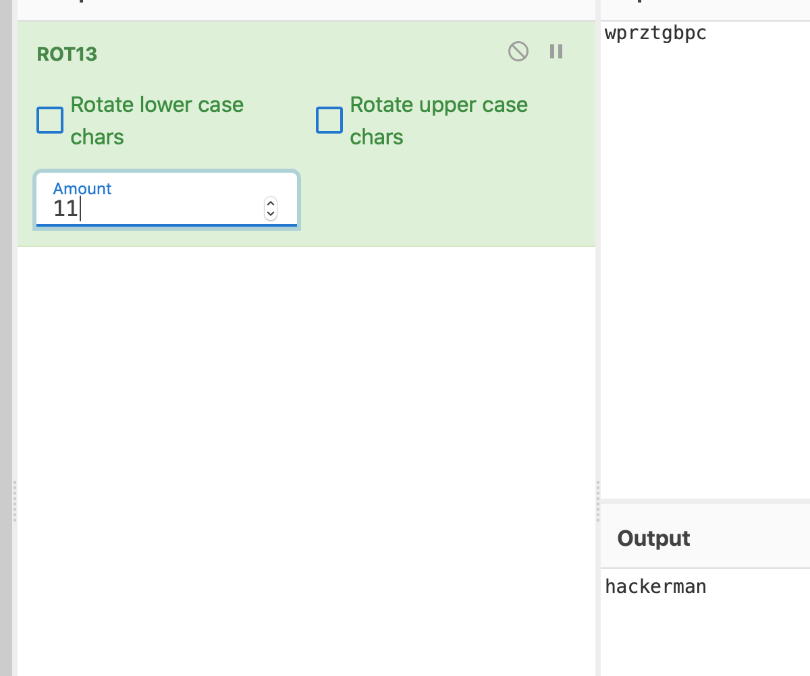

The next page shows us that the word we found is the flag:


```
hackmac{hackerman}
```


# Connect Home

This challenge was very simple, and was required to have access to the rest of the 'Hack the CISO' challenges. It is more of a tutorial to gain access to the CISO network through a VPN, rather than a challenge.

The flag for this challenge is the IP address given in the challenge description, written in the flag's format.

```
hackmac{137.111.189.100}
```


# Intelli-telnet

This challenge is relatively simple. The description gives us a great deal of information:

 - The telnet password is the device's default
 - The device is a Zmodo camera
 - The flag is the password (in the flag format)

A quick google search shows reports of a telnet password for this device being

```
zmodo19820816
```

Attempting to connect to the host with this password shows that this is the correct password, so the flag is:
```
hackmac{zmodo19820816}
```


# Remote Access 1

Both remote access challenges were solved after hints were already given, but with techniques learned after the event I will explain what I believe is the intended solution.

## Solve with hint

The hint suggests that we look up a wikipedia list for the 10,000 most common passwords, and gives us a number (2211). By looking at the 2211th most common password, `trance`, we can log into the RDP server.

In the standard format, the flag is:

```
hackmac{trance}
```

## Intended solution

The intended solution was likely a dictionary brute-force attack on the target host using Wikipedia's most common passwords list as the dictionary.


# Remote Access 2

Similar to [Remote Access 1](../remoteaccess1/remoteaccess1.md), this challenge was solved after the hints were released. The same method is used in this challenge, but now the hint says `2213`. The corresponding password in the Wikipedia list is `playtime`, so the flag is:

```
hackmac{playtime}
```


# RTSP That Thing

From the challenge description, we can find some useful pieces of information:
 - We're looking for an RTSP stream
 - The stream is unencrypted
 - The brand of camera is Zmodo

Let's first have a look at what ports we should be scanning. A quick google search for `Zmodo RTSP` shows some common URLs used by Zmodo cameras to display their RTSP feeds. They appear to use the port 10554.

We can do an nmap scan of the network to find hosts with this port open.

Now that we have the host address, we can try some of the common URLs in VLC to get the RTSP stream.

```
rtsp://192.168.100.210:10554/udp/av0_0
```
This gives us a video stream, and the flag is written on a piece of paper.

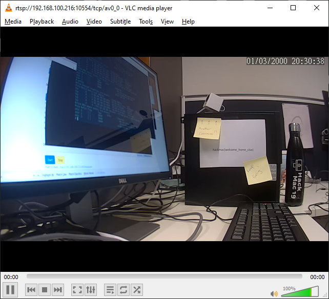
`Screenshot Credit: David Sanders`

```
hackmac{welcome_home_ciso}
```


# Smart Camera Secret File

This challenge is a continuation of [Intelli-telnet](../intellitelnet/intellitelnet.md). Firstly, we need to connect to the camera with Telnet using the password from the previous challenge.

Once we are in, we can start looking for the hidden file mentioned in the challenge description.

```
$ ls -a
```

Nothing of note is found in this directory, so we can navigate up a directory and list the files

```
$ cd ..
$ ls -a
```

Here, we can see a file of note. We can access the contents of the file:

```
$ cat flag.txt
```

And the flag is printed to the terminal!


# Time for a Little Magic Trick

Trying to open Joker.db in database software reveals it's not actually a database. 

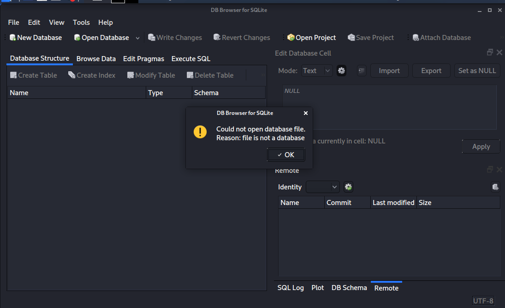

To see what is actually in the `.db` file, we can run

```bash
$ binwalk Joker.db
```  
This will reveal the true contents of the file

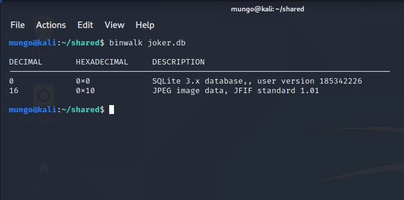

As we can see, the file has a JPEG image hidden within. To see the actual image, we need to extract it from the carrier file 

```bash
$   binwalk -D='.*' Joker.db
```

This will put the contents of the file in a new folder

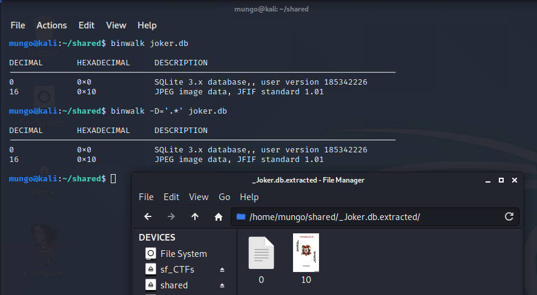

From here, we can simply open the file with an image viewer of choice

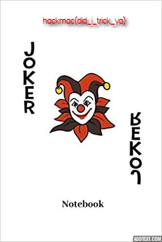

And we have our flag!
```
hackmac{did_i_trick_ya}
```


# Where's Wally

We are given an image file. Upon opening the image, it looks like a jumbled page from a Where's Wally book.

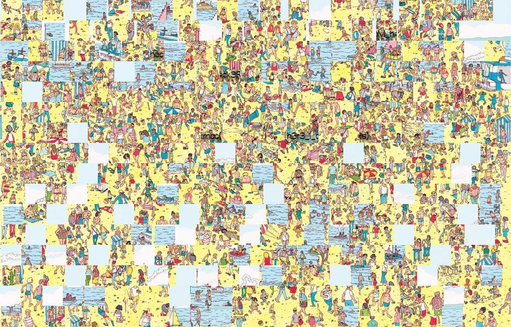

Upon closer inspection, we can see that there is some text that appears to have been written on the original image before it was jumbled up.

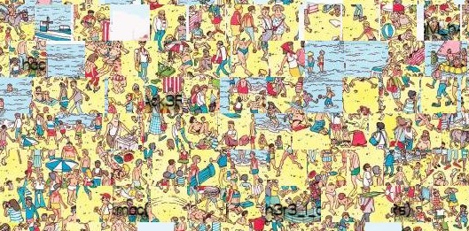

By rearranging these tiles with a graphic editor, we can find the flag

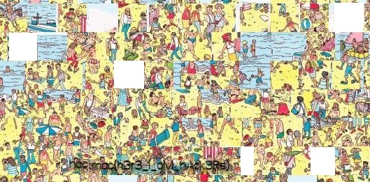

```
hackmac{h3r3_I_aM_hAck3Rs}
```