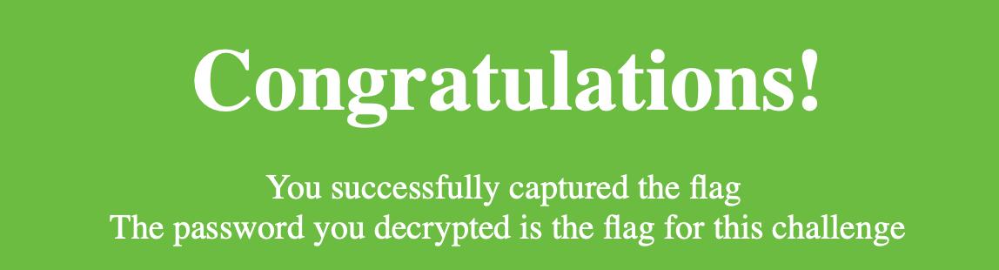
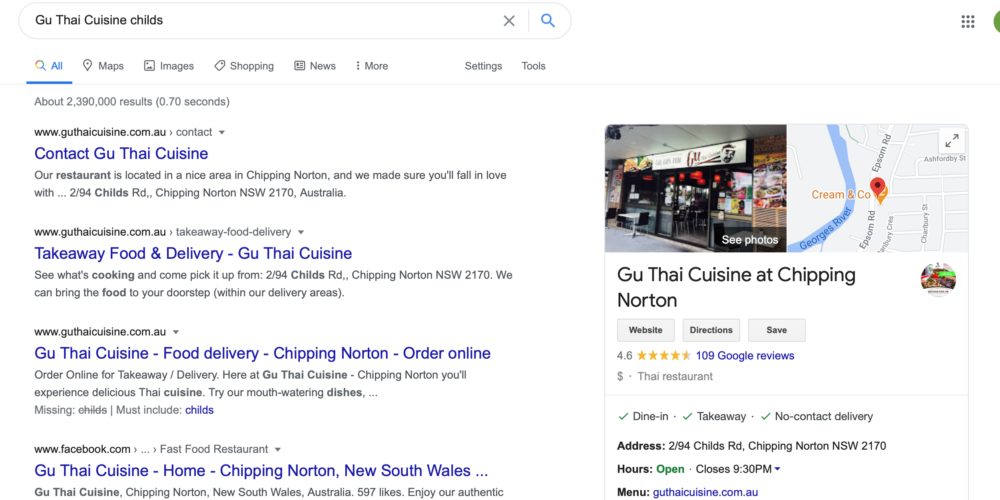
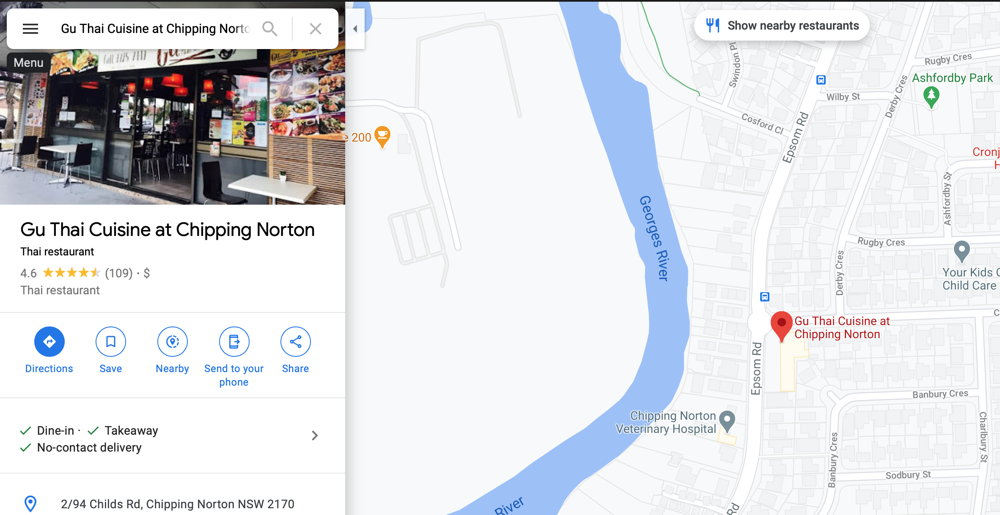
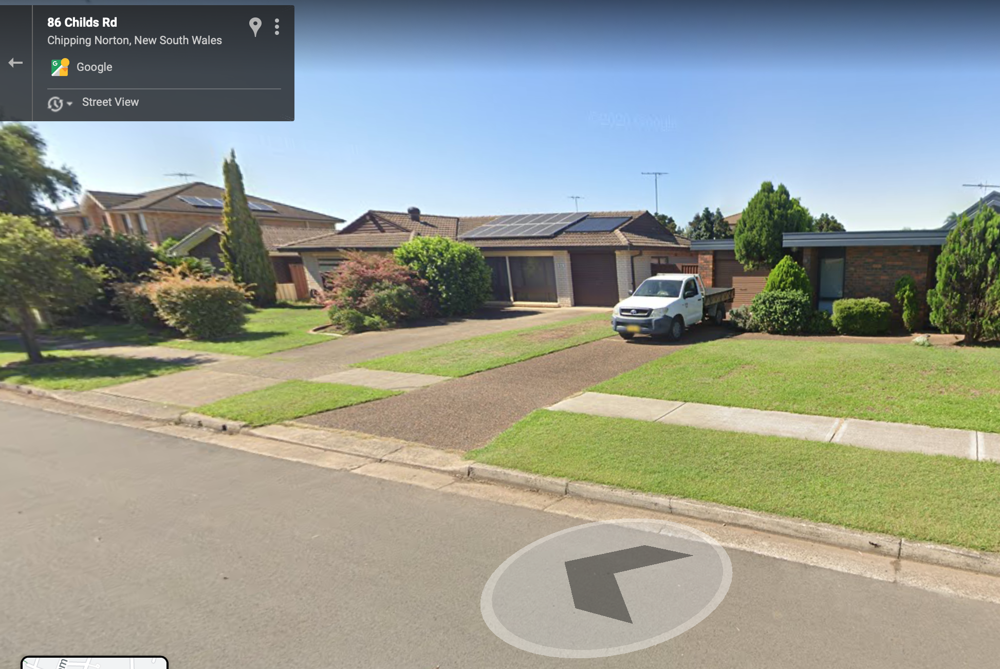

# Report - Universal Cereal Bus

## Table of Contents

- [Report - Universal Cereal Bus](#report---universal-cereal-bus)
  - [Table of Contents](#table-of-contents)
- [4 Stage = 4x Better](#4-stage--4x-better)
- [All The Wrappers](#all-the-wrappers)
- [Ancient Rome](#ancient-rome)
<<<<<<< HEAD
- [Ball Goes Brrrr](#ball-goes-brrrr)
- [Change the World](#change-the-world)
- [Connect Home](#connect-home)
- [First Day at Uni!](#first-day-at-uni)
- [Intelli-telnet](#intelli-telnet)
- [Keep Me Posted](#keep-me-posted)
- [Postman Pat knows everything about 13 Rotten Apples](#postman-pat-knows-everything-about-13-rotten-apples)
=======
- [Connect Home](#connect-home)
- [Intelli-telnet](#intelli-telnet)
>>>>>>> 20eba4f3ce54afb133d4fd50bbfbe33caebadba2
- [Remote Access 1](#remote-access-1)
  - [Solve with hint](#solve-with-hint)
  - [Intended solution](#intended-solution)
- [Remote Access 2](#remote-access-2)
- [RTSP That Thing](#rtsp-that-thing)
- [Smart Camera Secret File](#smart-camera-secret-file)
<<<<<<< HEAD
- [The Reality Deep Down in our Hearts](#the-reality-deep-down-in-our-hearts)
- [Time for a Little Magic Trick](#time-for-a-little-magic-trick)
- [To Kill a Blue Bird](#to-kill-a-blue-bird)
- [Uh Oh](#uh-oh)
- [Way Back Home](#way-back-home)
- [Where's Jeffery?](#wheres-jeffery)
- [Where's Wally](#wheres-wally)
- [Work work work work work](#work-work-work-work-work)
=======
- [Time for a Little Magic Trick](#time-for-a-little-magic-trick)
- [Where's Wally](#wheres-wally)
>>>>>>> 20eba4f3ce54afb133d4fd50bbfbe33caebadba2


# 4 Stage = 4x Better

We are given the link:
```
https://chal.hackmac.xyz:30105
```


The title tells us we have 4 stages to get through.

**Stage 1:**


A caesar salad can only mean one thing - Caesar cipher. Running it through CyberChef (rotating through all the numbers until we reached a word) gives us:

`Germany`


**Stage 2:**


This definitely looks like morse code but running it through CyberChef gives us something that doesn't look right (confirmed by trying to submit it in the final flag).


Even trying to change the delimiter to a forward slash did not provide a result:


So, by manually checking each one against the morse code lookup table:


We got:

`Jamaica`

**Stage 3:**


This definitely looks like a substitution cipher, but it wasn't immediately clear that the 'hint' was actually a 'key'. After trying a couple of manual substitutions, we tried the Vigenere decode on it and it returned:

`Afghanistan`


**Stage 4:**


The weapon appears to be an MP5, and a hash brown likely means it relates to a hash. So by running the text we were given, on an MD5 hash decode lookup 
```
https://md5.gromweb.com/?md5=4647d00cf81f8fb0ab80f753320d0fc9
```

We get:

`Indonesia`


The next page shows us that the words we found are the flag:


```
hackmac{GermanyJamaicaAfghanistanIndonesia}
```


# All The Wrappers

We are given the file `Present.gz` which appears to be a `gzipped` compressed file. To confirm, we will run the `file` command:


This confirms that it is indeed a gzip file. We also get a hint for a later phase of the challenge in the previous filename, `pmudxeh.ti deppord i spoohw`, which is `whoops i dropped it.hexdump` in reverse. For the meantime, we will unzip the file using the `gunzip` command:
```bash
$ gunzip Present.gz
```

This gives us an uncompressed file. We'll run `file` again to see what to do with it:


Running `cat` to display the contents of the file reveals it is indeed a hexdump. 


To reverse the hexdump into what appears to be binary, `xxd` with the `-r` option will give us a file with the original data:

```bash
$ xxd -r > file.txt
```

Now that we have this binary data, we can use the web tool CyberChef to decode it. With the binary input from the file, we can conver it:

1. From Binary:

```
GU2CANBZEAZTEIBVGIQDKNJAGMZCANJSEA2TIIBTGIQDKNBAHE3SAMZSEA2TIIBUHEQDGMRAGUYSANJQEAZTEIBVGEQDIOJAGMZCANJUEA2TMIBTGIQDKMZAGU3SAMZSEA2TCIBVGEQDGMRAGU2SANJSEAZTEIBVGQQDSOBAGMZCANJUEA2TAIBTGIQDKMJAGQ4SAMZSEA2TCIBVG4QDGMRAGUYSANJTEAZTEIBVGQQDKMBAGMZCANJREA2TCIBTGIQDKMZAGU2CAMZSEA2TIIBVGQQDGMRAGU2CANJQEAZTEIBVGIQDKNJAGMZCANJUEA4TSIBTGIQDKNJAGUYCAMZSEA2TGIBZG4QDGMRAGUZSANJUEAZTEIBVGEQDKNZAGMZCANJREA2TGIBTGIQDKNBAGUYCAMZSEA2TCIBVGEQDGMRAGUZSANJUEAZTEIBVGUQDKNZAGMZCANJTEA2TMIBTGIQDKMJAGUYSAMZSEA2TEIBVGAQDGMRAGU2SANJXEAZTEIBVGMQDSNZAGMZCANJTEA2TMIBTGIQDKMRAGEYDCIBTGIQDKNBAHE4SAMZSEA2TIIBVGAQDGMRAGU2CAMJQGEQDGMRAGUZSANJQEAZTEIBVGEQDKNY=
```
The `=` sign at the end of the string indicates it's a number system of a higher base, such as base32 or base64. As there are only upper-case characters visible, we can assume base32.

2. From Base32:
   
```
54 49 32 52 55 32 52 54 32 54 97 32 54 49 32 51 50 32 51 49 32 54 56 32 53 57 32 51 51 32 55 52 32 54 98 32 54 50 32 51 49 32 51 57 32 51 53 32 54 50 32 51 51 32 53 54 32 54 54 32 54 50 32 52 55 32 54 99 32 55 50 32 53 97 32 53 54 32 51 57 32 51 53 32 54 50 32 51 51 32 53 54 32 55 57 32 53 56 32 51 51 32 52 50 32 55 57 32 53 97 32 53 56 32 52 101 32 54 99 32 54 50 32 54 101 32 53 50 32 51 57
```

As there are instances of the digit `9`, this can't be octal. There are no letters, so it probably isn't hexadecimal. We will assume this is in decimal.

3. From Decimal:

```
61 47 46 6a 61 32 31 68 59 33 74 6b 62 31 39 35 62 33 56 66 62 47 6c 72 5a 56 39 35 62 33 56 79 58 33 42 79 5a 58 4e 6c 62 6e 52 39
```

This looks like hexadecimal, as there are no letters above `f`.

4. From Hexadecimal:

```
aGFja21hY3tkb195b3VfbGlrZV95b3VyX3ByZXNlbnR9
```
We can see a combination of digits, uppercase and lowercase alphabetical characters, so this could be base64.

5. From Base64:

```
hackmac{do_you_like_your_present}
```

There's our flag!

This is what the final CyberChef window looks like:


# Ancient Rome

Since the challenge is in the crypto section, the name hints that we are potentially dealing with a Caesar cipher. We are given the link:
```
https://chal.hackmac.xyz:30106
```


We are given a hint that confirms this has to do with Caesar:


By having CyberChef loaded, and quickly putting the encrypted password in, the only thing left is to shift by a random number (or seemingly random, as it changed with each encrypted password we tried), in less than 15 seconds, until we are left with a word that makes sense:


The next page shows us that the word we found is the flag:



```
hackmac{hackerman}
```


<<<<<<< HEAD
# Ball Goes Brrrr

We knew that Jeffery's twitter gave us insight into his love for basketball. Checking his following again, we see there is only one Australian account:


Initially, we tried `sydney` as this was the location on their twitter page, however this did not work.

Going to their linked website:

https://parramattawildcats.basketball/ubl

Revealed the account was for the `Parramatta Wild Cats`.

However, `parramatta` also did not work.

Scrolling down, we found out they were playing at `Lidcombe`:


However, this also did not work. Thankfully, trying `Auburn` worked.

```
hackmac{auburn}
```

# Change the World

Checking the same image from the challenge `Keep Me Posted`:


We see there is a Google Doc file open on the laptop, and for the most part, the link is visible:


```
1VdtzR1sjB5qkxhJZ9AJg*oeyrYvw_*JFKuCmRAD7kLU
```
The two `*` signs resemble characters that could be `lowercase i`, `uppercase i`, or `lowercase l`

This meant 6 possible permutations. A quick Excel concatenation:

```
=CONCATENATE(A1,B1,C1,D1,E1,F1)
```


After trying some links, one worked:

```
https://docs.google.com/document/d/1VdtzR1sjB5qkxhJZ9AJgioeyrYvw_lJFKuCmRAD7kLU/edit
```

Ctrl+F for `hackmac{` led to a flag in the hackmac format:


```
hackmac{you_should_not_be_here}
```

=======
>>>>>>> 20eba4f3ce54afb133d4fd50bbfbe33caebadba2

# Connect Home

This challenge was very simple, and was required to have access to the rest of the 'Hack the CISO' challenges. It is more of a tutorial to gain access to the CISO network through a VPN, rather than a challenge.

The flag for this challenge is the IP address given in the challenge description, written in the flag's format.

```
hackmac{137.111.189.100}
```
<<<<<<< HEAD
# First Day at Uni!

We are given Jeffery's instagram page:
```
https://www.instagram.com/j3ff3ryth3r3f3r33/
```
He has about 6 posts that appear to be relevant to MQ:


By looking at each one, we find that he is 2 minutes late to class in this one:


By inspecting element, we see this was taken at around 2:00am on the 23rd of September. However, it definitely doesn't look like it's 2:00am (and it'd be unlikely his class would be on then). A google search shows that this time is likely to be GMT, 11 hours behind AEST (since the picture was before daylight savings, we don't have to worry about AEDT).

This means his class started at 1PM.

It's like to assume it either finished at 2PM or 3PM, however, another post shows him leaving class:


By inspecting element again, we see it was an hour class, and he finished at 2PM.


Additionally, this looks like it's around 9 Wallys Walk, and since we're told to use the old building number, we know he's had class at E6A.

Arranging all this information into the flag format, we know the flag is:

```
hackmac{E6A_1PM_2PM}
```
=======

>>>>>>> 20eba4f3ce54afb133d4fd50bbfbe33caebadba2


# Intelli-telnet

This challenge is relatively simple. The description gives us a great deal of information:

 - The telnet password is the device's default
 - The device is a Zmodo camera
 - The flag is the password (in the flag format)

A quick google search shows reports of a telnet password for this device being

```
zmodo19820816
```

Attempting to connect to the host with this password shows that this is the correct password, so the flag is:
```
hackmac{zmodo19820816}
```


<<<<<<< HEAD
# Keep Me Posted

Originally, we could not see many of Jeffery's twitter posts, but eventually, we were able to see this post:


We see a wall of post-it notes, where one has a flag in the hackmac format:


```
hackmac{I_AM_INVISIBLE}
```

# Postman Pat knows everything about 13 Rotten Apples

On Jeffery's Twitter we can see he has a follower called "Aaron Boolon" who is also a fake account created for Hackmac:


We could see his first post referred to `"13 ROTten Apples"`, so we knew it was likely to be related to this challenge.


We could see an encrypted message in the form of a hyperlink (due to the `://`)

Using Cyberchef, and decoding ROT13:


We get a new hackmac website:

```
http://badboys.hackmac.xyz
```
On the website, we see an option that says `flag`:


Of course, we click on this and we get something in the hackmac flag format:


```
hackmac{hello_mr_postman}
```


=======
>>>>>>> 20eba4f3ce54afb133d4fd50bbfbe33caebadba2

# Remote Access 1

Both remote access challenges were solved after hints were already given, but with techniques learned after the event I will explain what I believe is the intended solution.

## Solve with hint

The hint suggests that we look up a wikipedia list for the 10,000 most common passwords, and gives us a number (2211). By looking at the 2211th most common password, `trance`, we can log into the RDP server.

In the standard format, the flag is:

```
hackmac{trance}
```

## Intended solution

The intended solution was likely a dictionary brute-force attack on the target host using Wikipedia's most common passwords list as the dictionary.


# Remote Access 2

Similar to [Remote Access 1](../remoteaccess1/remoteaccess1.md), this challenge was solved after the hints were released. The same method is used in this challenge, but now the hint says `2213`. The corresponding password in the Wikipedia list is `playtime`, so the flag is:

```
hackmac{playtime}
```


# RTSP That Thing

From the challenge description, we can find some useful pieces of information:
 - We're looking for an RTSP stream
 - The stream is unencrypted
 - The brand of camera is Zmodo

Let's first have a look at what ports we should be scanning. A quick google search for `Zmodo RTSP` shows some common URLs used by Zmodo cameras to display their RTSP feeds. They appear to use the port 10554.

We can do an nmap scan of the network to find hosts with this port open.

Now that we have the host address, we can try some of the common URLs in VLC to get the RTSP stream.

```
rtsp://192.168.100.210:10554/udp/av0_0
```
This gives us a video stream, and the flag is written on a piece of paper.


`Screenshot Credit: David Sanders`

```
hackmac{welcome_home_ciso}
```


# Smart Camera Secret File

This challenge is a continuation of [Intelli-telnet](../intellitelnet/intellitelnet.md). Firstly, we need to connect to the camera with Telnet using the password from the previous challenge.

Once we are in, we can start looking for the hidden file mentioned in the challenge description.

```
$ ls -a
```

Nothing of note is found in this directory, so we can navigate up a directory and list the files

```
$ cd ..
$ ls -a
```

Here, we can see a file of note. We can access the contents of the file:

```
$ cat flag.txt
```

And the flag is printed to the terminal!


<<<<<<< HEAD


# The Reality Deep Down in our Hearts

The `posts` page on the badboys website shows us this image and description:


It makes reference to a restaurant called `Gu Thai Cuisine`. Although we don't see that name in the Instagram page, we know Jeffery went to two places that serve Asian food. 

As one of the posts says `Sushi Hotaru`, by elimination, we figure out it is most likely referring to the other post made on the 27th of September:


We inspect element and check this would still be on the same date in AEST time:


```
hackmac{27_September}
```


=======
>>>>>>> 20eba4f3ce54afb133d4fd50bbfbe33caebadba2
# Time for a Little Magic Trick

Trying to open Joker.db in database software reveals it's not actually a database. 


To see what is actually in the `.db` file, we can run

```bash
$ binwalk Joker.db
```  
This will reveal the true contents of the file


As we can see, the file has a JPEG image hidden within. To see the actual image, we need to extract it from the carrier file 

```bash
$   binwalk -D='.*' Joker.db
```

This will put the contents of the file in a new folder


From here, we can simply open the file with an image viewer of choice


And we have our flag!
```
hackmac{did_i_trick_ya}
```

<<<<<<< HEAD
# To Kill a Blue Bird

We knew it was likely that Jeffery wouldn't only have an instagram page, and so we checked twitter right away. We tried:
```
https://twitter.com/j3ff3ryth3r3f3r33/
```
which gave us no results.

However, by looking up `j3ff3ryth3r3f3r33` in the Twitter search bar, we got this page:


A quick look at his followers shows the majority of pages are related to basketball:


Hence we presumed it is likely he plays basketball.

NOTE: A google search for 'Blue Bird' didn't reveal anything particularly insightful, and to this day, I'm not too sure on its relation to the challenge (although I believe it is possible it could have been a hint).

```
hackmac{basketball}
```


# Uh Oh

Checking the same image from the challenge `'The Reality Deep Down in our Hearts'`:


We can see this photo has obviously been photoshopped, and it is likely we will be looking for a car that looks like the one in the photo (without a broken windshield), presumably in Google maps street view.

A Google maps search for a place called `Gu Thai Cuisine` on `childs`:



Reveals there is a restaurant in Chipping Norton on Childs Rd:



We realise the location is likely to be on this street, and so we look for a vehicle resembling the one in the picture. We eventually find a vehicle in front of a house made from the same material as shown in the picture, at `86 Childs Rd, Chipping Norton`:



We rearrange this information to fit the flag format provided.

```
hackmac{86_childs_rd_chipping_norton}
```


# Way Back Home

In this challenge, we knew the title probably referred to using the `Wayback Machine`:

```
https://web.archive.org
```
We tried checking Jeffery's Twitter, Instagram, LinkedIn, Aaron's Twitter (and just about every other thing we had found up until this point), until we checked the badboys website:


Checking this result immediately gave us a flag in the hackmac format:


```
hackmac{jordan_has_my_family_send_help}
```

# Where's Jeffery?

From one of the instagram posts, we knew Jeffery had replied to a message with a reference to a Snapchat account:


From here, we went to:
```
https://drive.google.com/file/d/1KxEopR-EjLyZf9MHpcUtvzaBjEPu_xLR/view
```
And had access to his snapcode:


We created a snapchat account, scanned the snapcode on mobile, and did get added right away. 

Originally we tried sending Jeffery messages, but received a sticker telling us to "go away" as he only talks to his real friends.

However, when we realised Snapchat had a map with friends' locations, we could see he was in Dee Why.

NOTE: Unfortunately, we did not get screenshots on mobile (and could not retrospectively access the snap map).

```
hackmac{deewhy}
```
=======
>>>>>>> 20eba4f3ce54afb133d4fd50bbfbe33caebadba2


# Where's Wally

We are given an image file. Upon opening the image, it looks like a jumbled page from a Where's Wally book.


Upon closer inspection, we can see that there is some text that appears to have been written on the original image before it was jumbled up.


By rearranging these tiles with a graphic editor, we can find the flag


```
hackmac{h3r3_I_aM_hAck3Rs}
<<<<<<< HEAD
```


# Work work work work work

This flag asks us to find out where Jeffery works. From the instagram page, we know that Jeffery's full name is `Jeffery Emmanuel Lee`:


It is likely that he would put his occupation on either a Facebook or LinkedIn page.

The first result we get when searching `Jeffery Lee` on LinkedIn gives us a fake person for hackmac:


We see a flag in the hackmac format.

```
hackmac{yes_i_sell_stuff_hehe}
=======
>>>>>>> 20eba4f3ce54afb133d4fd50bbfbe33caebadba2
```