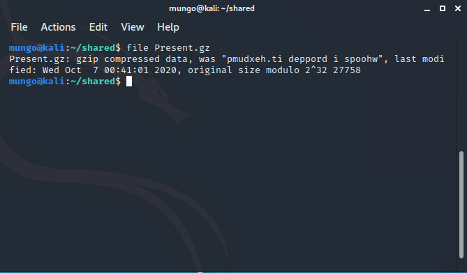
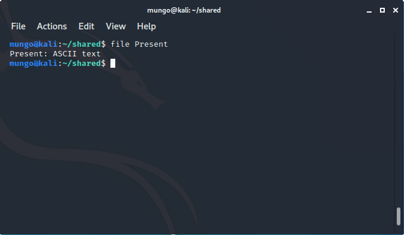
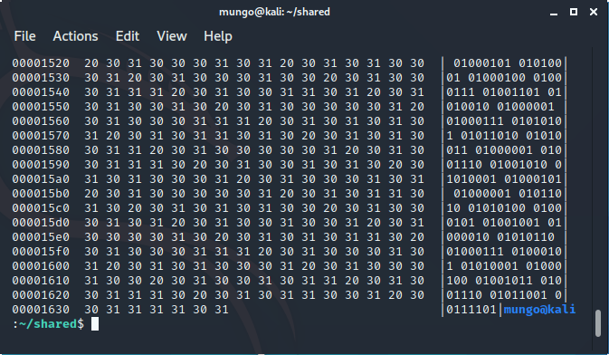

# All The Wrappers

We are given the file `Present.gz` which appears to be a `gzipped` compressed file. To confirm, we will run the `file` command:



This confirms that it is indeed a gzip file. We also get a hint for a later phase of the challenge in the previous filename, `pmudxeh.ti deppord i spoohw`, which is `whoops i dropped it.hexdump` in reverse. For the meantime, we will unzip the file using the `gunzip` command:
```bash
$ gunzip Present.gz
```

This gives us an uncompressed file. We'll run `file` again to see what to do with it:



Running `cat` to display the contents of the file reveals it is indeed a hexdump. 



To reverse the hexdump into what appears to be binary, `xxd` with the `-r` option will give us a file with the original data:

```bash
$ xxd -r > file.txt
```

Now that we have this binary data, we can use the web tool CyberChef to decode it. With the binary input from the file, we can conver it:

1. From Binary:

```
GU2CANBZEAZTEIBVGIQDKNJAGMZCANJSEA2TIIBTGIQDKNBAHE3SAMZSEA2TIIBUHEQDGMRAGUYSANJQEAZTEIBVGEQDIOJAGMZCANJUEA2TMIBTGIQDKMZAGU3SAMZSEA2TCIBVGEQDGMRAGU2SANJSEAZTEIBVGQQDSOBAGMZCANJUEA2TAIBTGIQDKMJAGQ4SAMZSEA2TCIBVG4QDGMRAGUYSANJTEAZTEIBVGQQDKMBAGMZCANJREA2TCIBTGIQDKMZAGU2CAMZSEA2TIIBVGQQDGMRAGU2CANJQEAZTEIBVGIQDKNJAGMZCANJUEA4TSIBTGIQDKNJAGUYCAMZSEA2TGIBZG4QDGMRAGUZSANJUEAZTEIBVGEQDKNZAGMZCANJREA2TGIBTGIQDKNBAGUYCAMZSEA2TCIBVGEQDGMRAGUZSANJUEAZTEIBVGUQDKNZAGMZCANJTEA2TMIBTGIQDKMJAGUYSAMZSEA2TEIBVGAQDGMRAGU2SANJXEAZTEIBVGMQDSNZAGMZCANJTEA2TMIBTGIQDKMRAGEYDCIBTGIQDKNBAHE4SAMZSEA2TIIBVGAQDGMRAGU2CAMJQGEQDGMRAGUZSANJQEAZTEIBVGEQDKNY=
```
The `=` sign at the end of the string indicates it's a number system of a higher base, such as base32 or base64. As there are only upper-case characters visible, we can assume base32.

2. From Base32:
   
```
54 49 32 52 55 32 52 54 32 54 97 32 54 49 32 51 50 32 51 49 32 54 56 32 53 57 32 51 51 32 55 52 32 54 98 32 54 50 32 51 49 32 51 57 32 51 53 32 54 50 32 51 51 32 53 54 32 54 54 32 54 50 32 52 55 32 54 99 32 55 50 32 53 97 32 53 54 32 51 57 32 51 53 32 54 50 32 51 51 32 53 54 32 55 57 32 53 56 32 51 51 32 52 50 32 55 57 32 53 97 32 53 56 32 52 101 32 54 99 32 54 50 32 54 101 32 53 50 32 51 57
```

As there are instances of the digit `9`, this can't be octal. There are no letters, so it probably isn't hexadecimal. We will assume this is in decimal.

3. From Decimal:

```
61 47 46 6a 61 32 31 68 59 33 74 6b 62 31 39 35 62 33 56 66 62 47 6c 72 5a 56 39 35 62 33 56 79 58 33 42 79 5a 58 4e 6c 62 6e 52 39
```

This looks like hexadecimal, as there are no letters above `f`.

4. From Hexadecimal:

```
aGFja21hY3tkb195b3VfbGlrZV95b3VyX3ByZXNlbnR9
```
We can see a combination of digits, uppercase and lowercase alphabetical characters, so this could be base64.

5. From Base64:

```
hackmac{do_you_like_your_present}
```

There's our flag!

This is what the final CyberChef window looks like:

