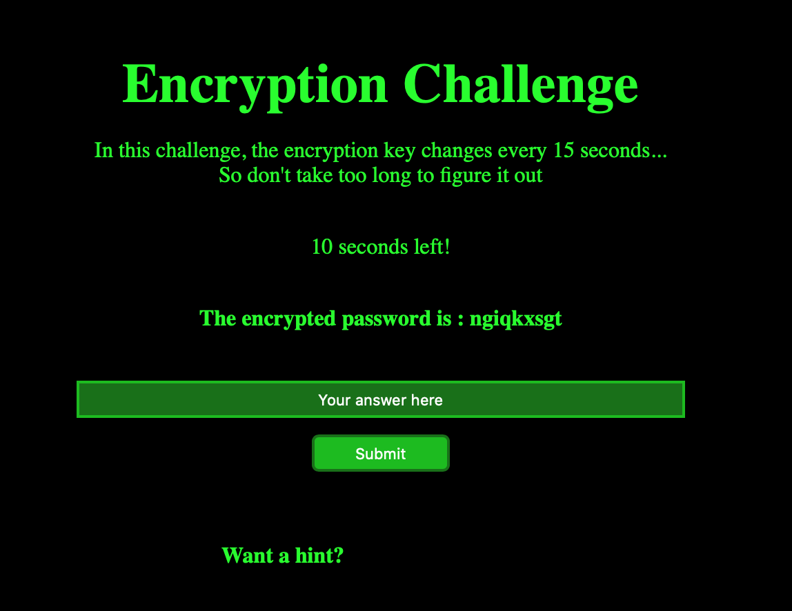
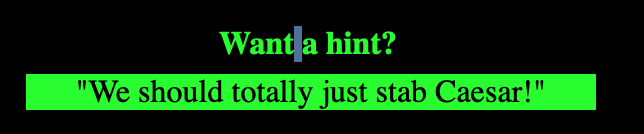
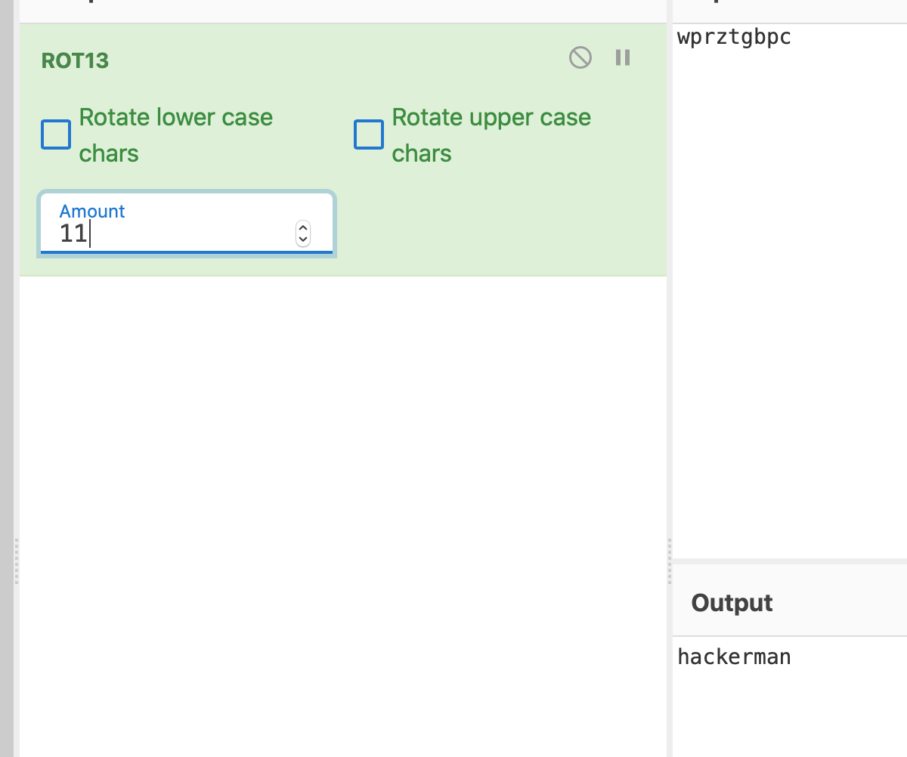

# Ancient Rome

Since the challenge is in the crypto section, the name hints that we are potentially dealing with a Caesar cipher. We are given the link:
```
https://chal.hackmac.xyz:30106
```



We are given a hint that confirms this has to do with Caesar:



By having CyberChef loaded, and quickly putting the encrypted password in, the only thing left is to shift by a random number (or seemingly random, as it changed with each encrypted password we tried), in less than 15 seconds, until we are left with a word that makes sense:



The next page shows us that the word we found is the flag:


```
hackmac{hackerman}
```