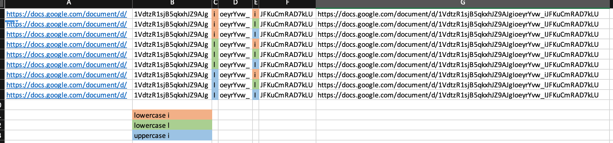

# Change the World

Checking the same image from the challenge `Keep Me Posted`:


We see there is a Google Doc file open on the laptop, and for the most part, the link is visible:


```
1VdtzR1sjB5qkxhJZ9AJg*oeyrYvw_*JFKuCmRAD7kLU
```
The two `*` signs resemble characters that could be `lowercase i`, `uppercase i`, or `lowercase l`

This meant 6 possible permutations. A quick Excel concatenation:

```
=CONCATENATE(A1,B1,C1,D1,E1,F1)
```



After trying some links, one worked:

```
https://docs.google.com/document/d/1VdtzR1sjB5qkxhJZ9AJgioeyrYvw_lJFKuCmRAD7kLU/edit
```

Ctrl+F for `hackmac{` led to a flag in the hackmac format:


```
hackmac{you_should_not_be_here}
```