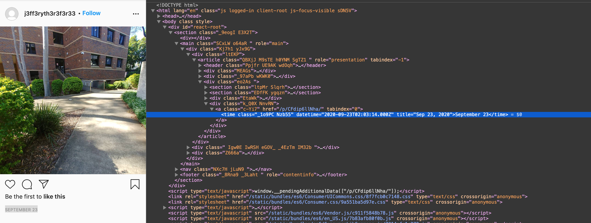
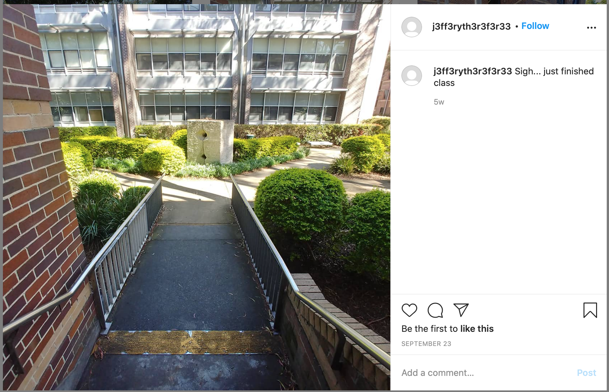
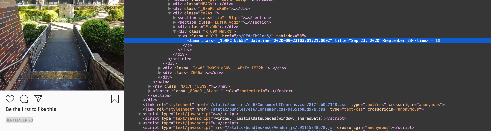

# First Day at Uni!

We are given Jeffery's instagram page:
```
https://www.instagram.com/j3ff3ryth3r3f3r33/
```
He has about 6 posts that appear to be relevant to MQ:


By looking at each one, we find that he is 2 minutes late to class in this one:




By inspecting element, we see this was taken at around 2:00am on the 23rd of September. However, it definitely doesn't look like it's 2:00am (and it'd be unlikely his class would be on then). A google search shows that this time is likely to be GMT, 11 hours behind AEST (since the picture was before daylight savings, we don't have to worry about AEDT).

This means his class started at 1PM.

It's like to assume it either finished at 2PM or 3PM, however, another post shows him leaving class:



By inspecting element again, we see it was an hour class, and he finished at 2PM.



Additionally, this looks like it's around 9 Wallys Walk, and since we're told to use the old building number, we know he's had class at E6A.

Arranging all this information into the flag format, we know the flag is:

```
hackmac{E6A_1PM_2PM}
```