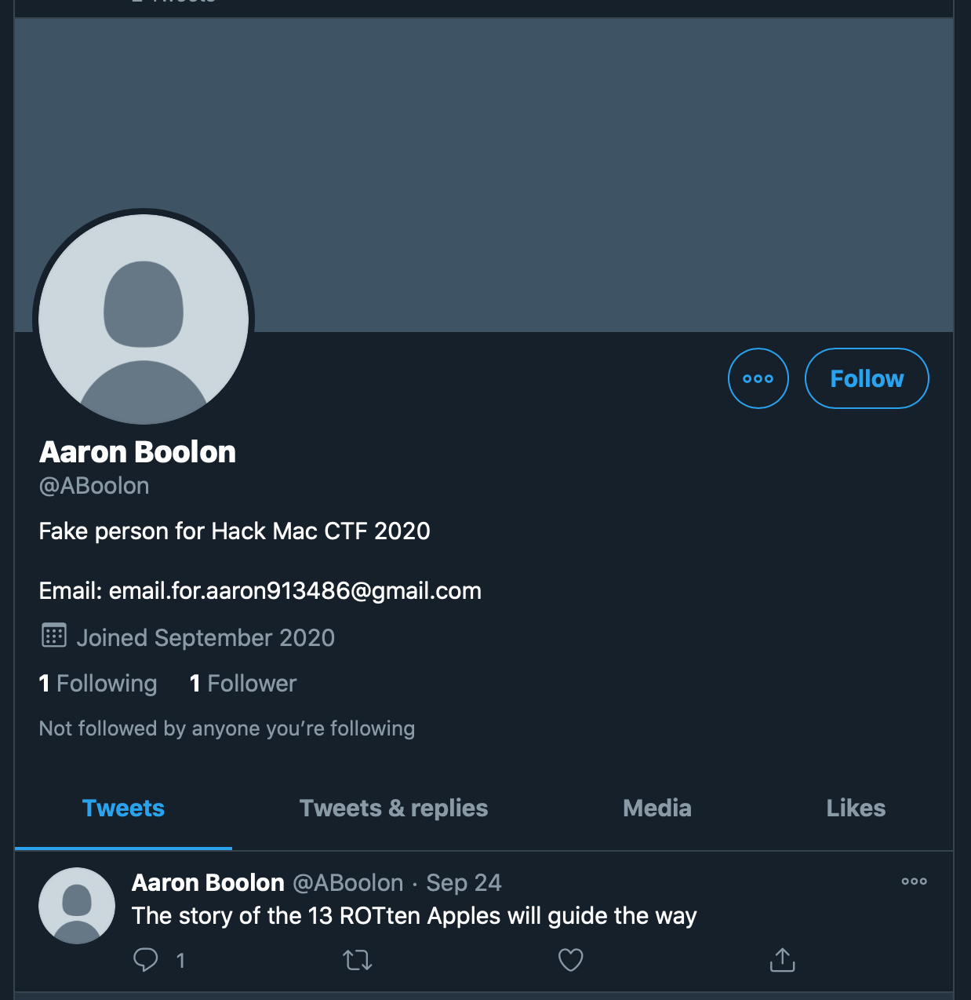
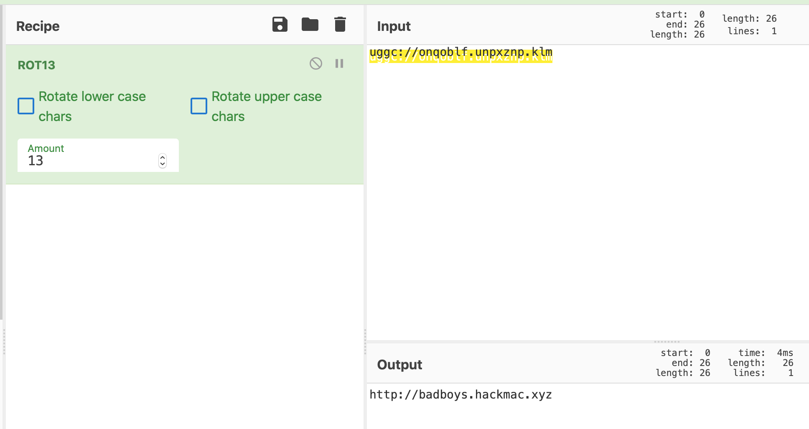
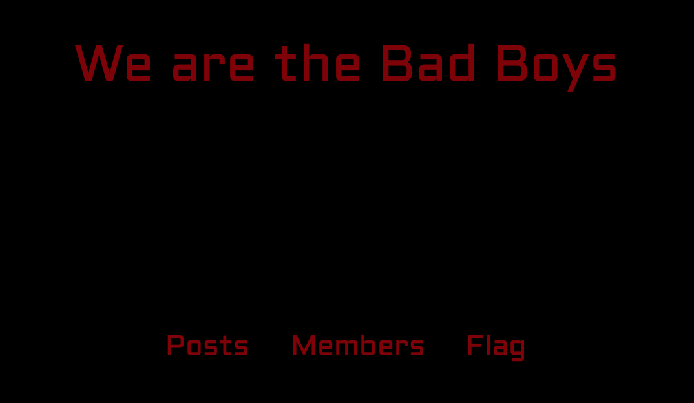

# Postman Pat knows everything about 13 Rotten Apples

On Jeffery's Twitter we can see he has a follower called "Aaron Boolon" who is also a fake account created for Hackmac:



We could see his first post referred to `"13 ROTten Apples"`, so we knew it was likely to be related to this challenge.


We could see an encrypted message in the form of a hyperlink (due to the `://`)

Using Cyberchef, and decoding ROT13:



We get a new hackmac website:

```
http://badboys.hackmac.xyz
```
On the website, we see an option that says `flag`:



Of course, we click on this and we get something in the hackmac flag format:


```
hackmac{hello_mr_postman}
```