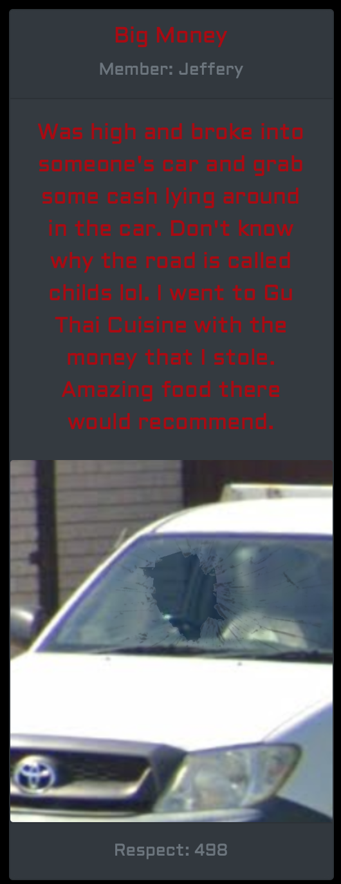
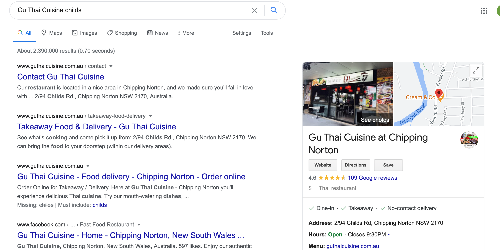
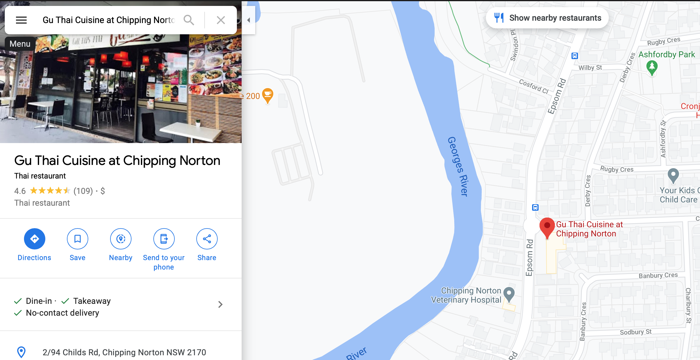
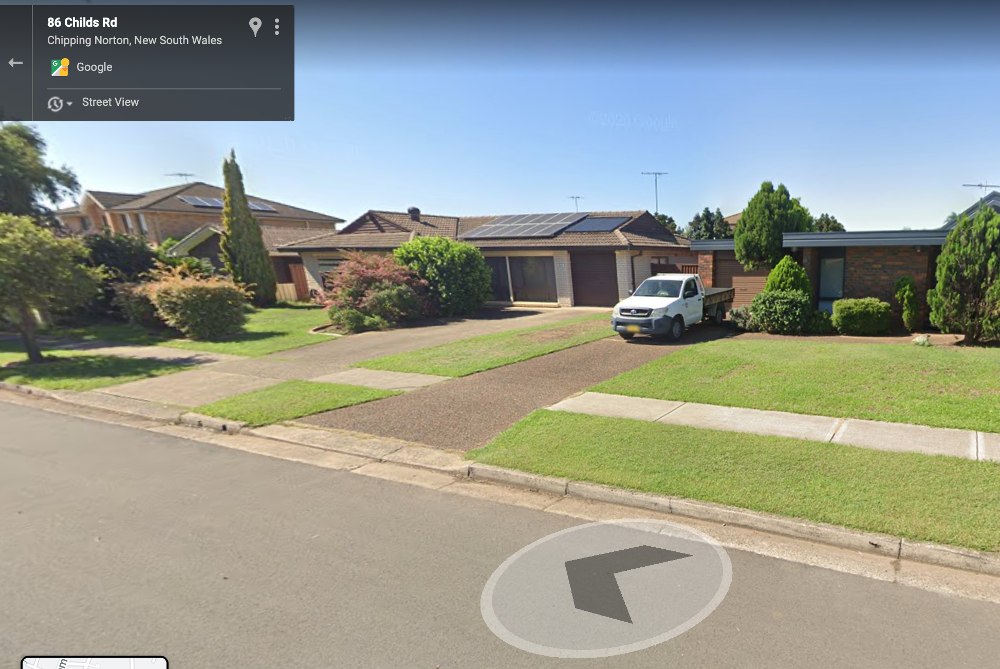

# Uh Oh

Checking the same image from the challenge `'The Reality Deep Down in our Hearts'`:



We can see this photo has obviously been photoshopped, and it is likely we will be looking for a car that looks like the one in the photo (without a broken windshield), presumably in Google maps street view.

A Google maps search for a place called `Gu Thai Cuisine` on `childs`:



Reveals there is a restaurant in Chipping Norton on Childs Rd:



We realise the location is likely to be on this street, and so we look for a vehicle resembling the one in the picture. We eventually find a vehicle in front of a house made from the same material as shown in the picture, at `86 Childs Rd, Chipping Norton`:



We rearrange this information to fit the flag format provided.

```
hackmac{86_childs_rd_chipping_norton}
```