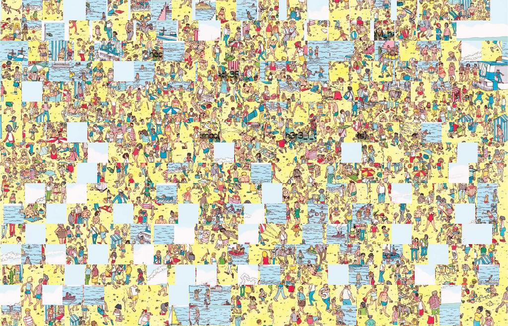
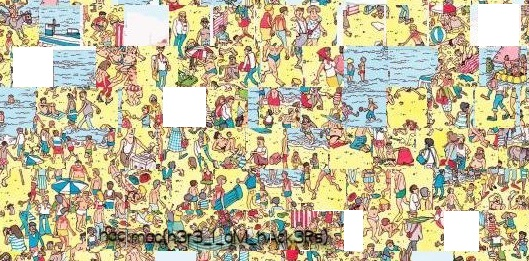

# Where's Wally

We are given an image file. Upon opening the image, it looks like a jumbled page from a Where's Wally book.



Upon closer inspection, we can see that there is some text that appears to have been written on the original image before it was jumbled up.


By rearranging these tiles with a graphic editor, we can find the flag



```
hackmac{h3r3_I_aM_hAck3Rs}